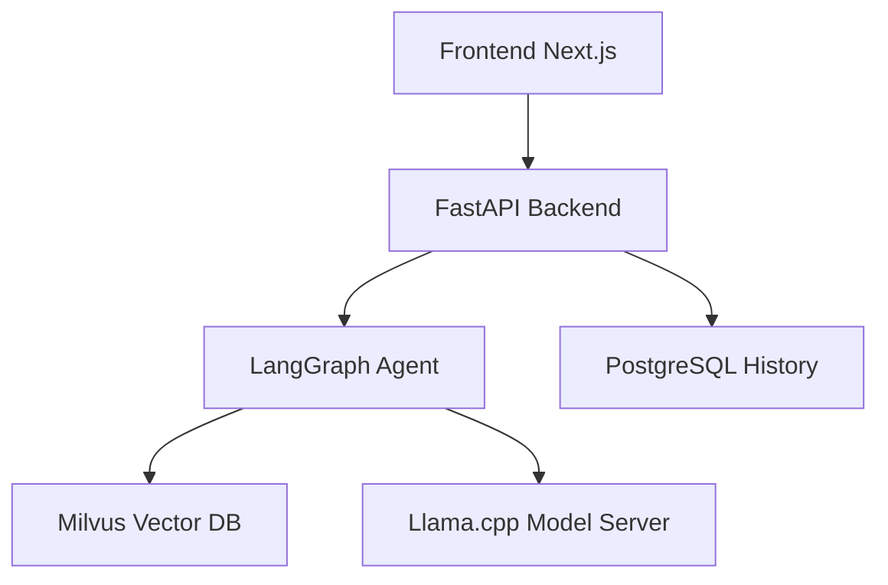

# Multi-Agent Chatbot with RAG & Vision

A powerful, self-hosted multi-agent chatbot featuring:

- **Retrieval Augmented Generation (RAG)**: Answer questions based on your local documents (PDF, DOCX, TXT).
- **Vision Integration**: Multi-modal capabilities for image understanding.
- **Unified Interface**: Modern, responsive web UI for chat and document management.
- **Flagship LLM**: Powered by NVIDIA's `gpt-oss-120b` (mxfp4) for high-performance inference.

## System Requirements

- **GPU**: NVIDIA GPU with 48GB+ VRAM (optimized for Blackwell/Hopper/Ada).
- **RAM**: 64GB+ System memory.
- **Disk Space**: ~160GB for models and database.
- **Environment**: Docker & Docker Compose with NVIDIA Container Toolkit.

## Quick Start

### 1. Clone the repository

```bash
git clone https://github.com/your-username/multi-agent-chatbot.git
cd multi-agent-chatbot
```

### 2. Prepare Models

The large model files are excluded from the repository. You must copy/download the required `.gguf` files into the `assets/models/` directory:

| Filename | Purpose |
| :--- | :--- |
| `gpt-oss-120b-mxfp4-00001-of-00003.gguf` | Flagship Chat Model (Part 1) |
| `gpt-oss-120b-mxfp4-00002-of-00003.gguf` | Flagship Chat Model (Part 2) |
| `gpt-oss-120b-mxfp4-00003-of-00003.gguf` | Flagship Chat Model (Part 3) |
| `Qwen2-VL-2B-Instruct-Q4_K_M.gguf` | Vision Model |
| `mmproj-Qwen2-VL-2B-Instruct-f16.gguf` | Vision Projection Layer |
| `qwen2.5-coder-1.5b-instruct-q4_k_m.gguf` | Code Generation Assistant |
| `qwen3-embedding-[...]` | RAG Embedding Model |

### 3. Launch Services

```bash
cd assets
docker compose up -d
```

Access the UI at: `http://localhost:3000`

## Features & Usage

- **Knowledge Base**: Upload files in the sidebar and click "Refresh" to index them.
- **Document View**: Hover over an indexed source and click the 👁 icon to view its content.
- **RAG Search**: The agent automatically searches selected sources when you ask questions.
- **Image Understanding**: Paste an image URL or upload to chat about visual content.

## Architecture



## License

Copyright (c) 1993-2025 NVIDIA CORPORATION & AFFILIATES. All rights reserved.
Apache License 2.0.
